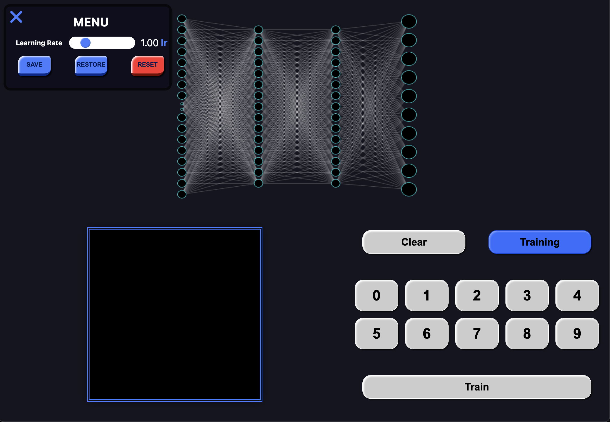
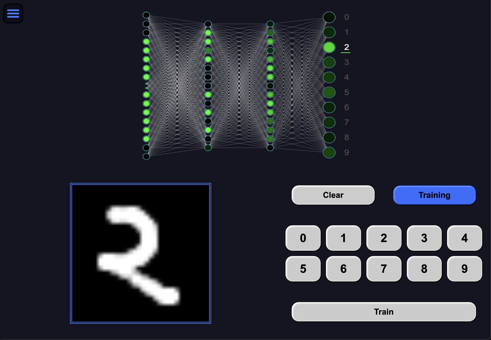

<h1 align="center"> <a href="https://elsesourav.github.io/nn-number-rec">Neural Network Number Recognition</a></h1>

 ## `Overview`
 > Neural Network Number Recognition is a project designed to train a neural network to recognize handwritten numbers. The project includes features to input drawings, visualize the input, hidden, and output layers, dynamically change the learning rate, and save the trained network to achieve accurate number recognition.

## `Features`
>
> - **Drawing Input:** Train the network using custom drawings.
>
> - **Layer Visualization:** Visualize the input, hidden, and output layers.
>
> - **Dynamic Learning Rate:** Adjust the learning rate dynamically during training.
>
> - **Save and Load Network:** Save the trained network for future use.
>
 

## `Technical Challenges and Optimizations`
### Drawing Input:
> Implementing an intuitive drawing interface for users to provide training data.
### Layer Visualization:
> Visualizing the different layers of the neural network to understand the learning process.

## `Screenshot`

## `License`

### This project is licensed under the [MIT License](./LICENSE.md).

## `Contact`

### For questions or feedback, please contact me

-  [Email](https://elsesourav@gmail.com)
-  [Twitter](https://twitter.com/elsesourav)
-  [Linkedin](https://linkedin.com/in/elsesourav)
-  [Facebook](https://fb.com/elsesourav)
-  [Instagram](https://instagram.com/elsesourav)

 

<h2 align="center"> <a href="https://elsesourav.github.io/nn-number-rec">Open App</a></h2>