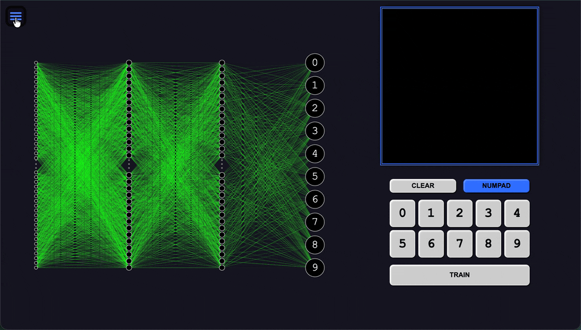
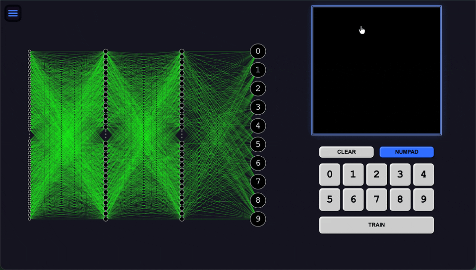

<h1 align="center"> <a href="https://elsesourav.github.io/nn-number-rec">Neural Network Number Recognition</a></h1>

## `Overview`

> Neural Network Number Recognition is a high-performance project designed to train a neural network to recognize handwritten numbers. It leverages **C++** and **WebAssembly (Wasm)** for the core training and inference logic, ensuring near-native performance in the browser. The project includes features to input drawings, visualize layers, and manage the model via the **Options** menu.

## `Features`

> -  **High Performance:** Powered by C++ compiled to WebAssembly.
>
> -  **Drawing Input:** Train the network using custom drawings.
>
> -  **Layer Visualization:** Visualize the input, hidden, and output layers.
>
> -  **Dynamic Learning Rate:** Adjust the learning rate dynamically during training.
>
> -  **Save and Load Network:** Save the trained network state and also load by pre trained model.
>
>  

## `Technical Architecture`

### WebAssembly Core (`cpp/wasm.cpp`)

> The core neural network logic, including matrix operations and backpropagation, is implemented in C++. This ensures that computationally intensive tasks like training are handled efficiently.

### Build System (`build.sh`)

> The project uses a shell script to compile the C++ code into WebAssembly using **Emscripten**. It applies optimizations like `-O3`, `-flto`, and `-msimd128` to maximize performance.

## `Technical Challenges and Optimizations`

### Drawing Input:

> Implementing an intuitive drawing interface for users to provide training data.

### Layer Visualization:

> Visualizing the different layers of the neural network to understand the learning process.

## `Screenshot`

### Overview

### Train & Test

## `License`

### This project is licensed under the [MIT License](./LICENSE.md).

## `Contact`

### For questions or feedback, please contact me

-  [Email](https://elsesourav@gmail.com)
-  [Twitter](https://twitter.com/elsesourav)
-  [Linkedin](https://linkedin.com/in/elsesourav)
-  [Facebook](https://fb.com/elsesourav)
-  [Instagram](https://instagram.com/elsesourav)

 

<h2 align="center"> <a href="https://elsesourav.github.io/nn-number-rec">Open App</a></h2>
